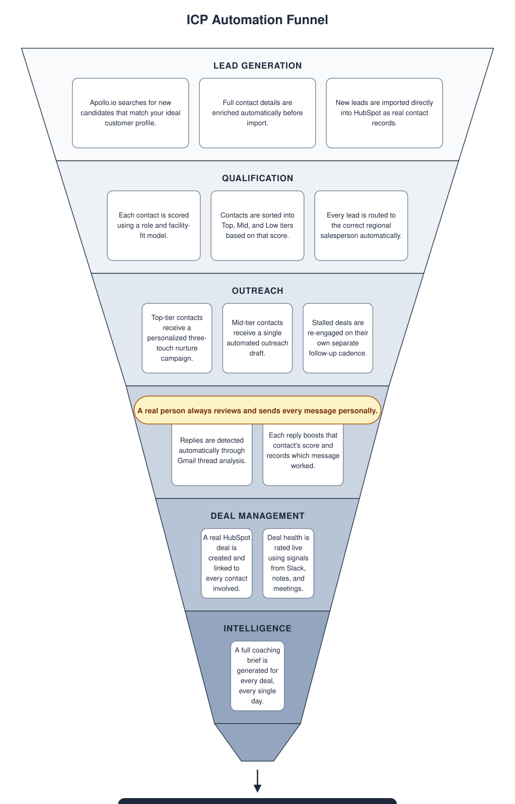

# **GTM AUTOMATION PROJECT**

Most sales tooling either does everything for you, and quietly loses the human touch in the process, or does nothing but store data, but leaves your reps drowning. This GTM Automation deliberately automates the thinking, scoring, drafting, coaching, signal-spotting, and leaves the *deciding* part entirely to a human. Nothing here ever sends a message on its own. It's built to make a good rep faster, not to replace the judgment that makes them good in the first place.

All contact/company data referenced during development is fictional test data.

## **The problems this solves, and exactly how**

**1. The excited person isn't always the person who can say yes.** A champion loving your product means nothing if the technical or procurement gatekeeper quietly kills the deal months later, unnoticed.The system automatically classifies every contact's role in the buying committee (executive, technical, procurement, end-user) and the persona library explicitly tells reps to engage the technical gatekeeper in parallel with the champion, not after. closing the single most common way multi-stakeholder deals silently stall.

**2. A rep can only write so many good, personal messages a day.** With a full pipeline, nobody hand-writes a thoughtful message to every lead, so most get generic blasts. For every high-value contact, the nurture-campaign engine automatically drafts a message referencing their specific bottleneck, pulled from real deal context (verified in testing: a real draft referenced a specific capital-budget conflict). The rep's job condenses to "read, adjust if needed, send."

**3. Deals die slowly, and nobody notices until it's too late.** Risk builds up quietly (a slower reply, a hesitant Slack comment) long before it's obvious. The live signal detection engine scans HubSpot Notes, Slack messages, and logged meetings for buying/risk language, and flips a deal's health color automatically. Verified live: a real Slack message flipped a deal from Yellow to Green with zero manual updating. Risk signals are built to override positive tone, so one real objection can't get buried under general good vibes.

**4. Nobody actually knows which messages work.** Most teams guess whether touch 2 or touch 3 drives replies, there's no real way to check. Every reply is tagged with exactly which touch number and campaign type triggered it, so "does our 3rd follow-up actually work?" gets a real answer instead of a shrug.

**5. The best rep's instincts disappear when they leave.** Objection handling and negotiation tricks usually live only in one person's head. A persona and battlecard library is reachable through an in-extension Claude chat so that any brand new hire can pull up the exact "don't say / do say" script instantly.

## File guide

| File | Purpose |
| :---- | :---- |
| funnel.py | Main pipeline: Apollo search -> score -> route -> draft |
| reengagement_pipeline.py | Separate 3-touch stalled-deal motion |
| create_deals.py | Builds real HubSpot Deals and links contacts to them |
| deal_coaching.py | Generates full AI coaching briefs per deal |
| data_foundation.py | Slack + HubSpot meeting/call harvesting, live signal detection |
| check_replies.py | Reply detection + dynamic score updates |
| weekly_digest.py | Posts aggregate stats to Slack |
| harvest_to_drive.py | Syncs live pipeline data to Google Drive |
| package_for_drive.py | Packages a clean, secret-free copy of this code for team distribution |
| chrome-extension/ | The live UI: dashboard, trends, Claude chat |
| .github/workflows/ | GitHub Actions configs for cloud scheduling |

---

## Setting it up

### 1. Python environment

**python3 -m venv venv**  
**source venv/bin/activate**  
**python3 -m pip install --upgrade pip**  
**pip install -r requirements.txt**

Known hurdle: if pip install fails trying to build cryptography from source (a Rust compiler error), it's because a too-new cryptography version has no pre-built wheel yet for your Python version. Fix:

**pip install "cryptography<43"**  
**pip install -r requirements.txt**

### **2. HubSpot**

- Create a Service Key (Settings -> Integrations -> Service Keys, or Legacy Apps on older accounts) with scopes: crm.objects.contacts.read/write, crm.objects.deals.read/write, crm.schemas.deals.write, crm.objects.companies.read  
- Create these custom Contact properties (exact labels matter -- the code looks them up by label):  
  - Lead Score (Number), Outreach Tier (Single-line text), Assigned Rep (Single-line text), Last Processed Date (Date picker), Deal Persona (Single-line text), Reengagement Touch Number (Number), Last Reengagement Date (Date picker), Deal Context (Multi-line text)  
- Create one custom Deal property: AI Coaching Brief (Multi-line text)  
- Known hurdle: HubSpot Free caps you at 10 custom properties account-wide (not per-object). If you hit the limit, archive one you're not actively using rather than fighting for more room.

### **3. Apollo.io**

- Requires a paid plan (Basic or higher) for API access -- the free tier has zero API access at all. A 14-day free trial of Basic works for testing.

### **4. Slack**

- Create a Slack app at api.slack.com/apps, add Bot Token Scopes: chat:write, channels:read, channels:history  
- Install/reinstall to your workspace, copy the Bot User OAuth Token

### **5. Google Cloud (Gmail + Drive)**

- Create a project at console.cloud.google.com, enable the Gmail API and Google Drive API  
- Create an OAuth Client ID, type Desktop app, download as credentials.json  
- Run python3 harvest_to_drive.py once locally -- it'll open a browser to approve access and generate token.json automatically

### **6. .env file**

Copy .env.example to .env and fill in HUBSPOT_SERVICE_KEY, APOLLO_API_KEY, SLACK_BOT_TOKEN, SLACK_CHANNEL.

### **7. Chrome extension**

- chrome://extensions -> Developer mode -> Load unpacked -> select chrome-extension/  
- It reads live from the pipeline_data.json file on Google Drive that harvest_to_drive.py creates -- sign in with the same Google account when prompted  
- Claude tab is optional -- each person connects their own Anthropic API key (console.anthropic.com), stored only in their own browser, never shared

### **8. Running it**

Either trigger it manually (python3 run_all.py), schedule it locally with launchd (see run_daily_with_retry.sh and the included .plist files), or push to your own GitHub repo and let GitHub Actions run it in the cloud daily, with your credentials stored as encrypted repo Secrets. See .github/workflows/ for the ready-made configs.

### **9. Known gotchas**

- Never move or rename the project folder after creating the venv -- Python bakes absolute paths into venv files, and moving the folder breaks it silently with confusing errors. Delete and recreate the venv if you move the project.  
- GitHub Actions + secrets containing quotes: never use echo "SECRET" > file for JSON secrets -- the embedded quotes break the shell command. Use the env: + printf pattern instead (already done correctly in daily.yml).  
- Google tokens can go stale on scope changes -- if you add a new Google API scope, delete token.json and re-authenticate, or force a refresh rather than trusting a cached access token.  
- Chrome extension IDs change per-install unless pinned -- the "key" field in manifest.json fixes this so the same OAuth setup works for everyone using this code, regardless of where they unzip it.

### **10. Customizing for your own business**

The architecture (scoring -> routing -> drafting -> coaching -> dashboard) is fully generic. What needs rewriting for a different product/industry:

- classify_role() and classify_facility_fit() in funnel.py -- currently hardcoded to a hospital buying committee (Chief of Cardiology, CMIO, etc.) and facility types. Rewrite these for your own ICP and buying committee.  
- The persona/battlecard library in the Chrome extension's popup.js -- specific to this product/industry, reusable as a pattern to follow, not as content.  
- Salesperson names and regions -- hardcoded in funnel.py and reengagement_pipeline.py (currently Prateek/Carole/Shiwam by US/Europe/APAC) -- swap for your actual team.

